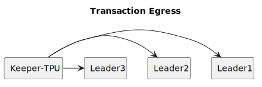
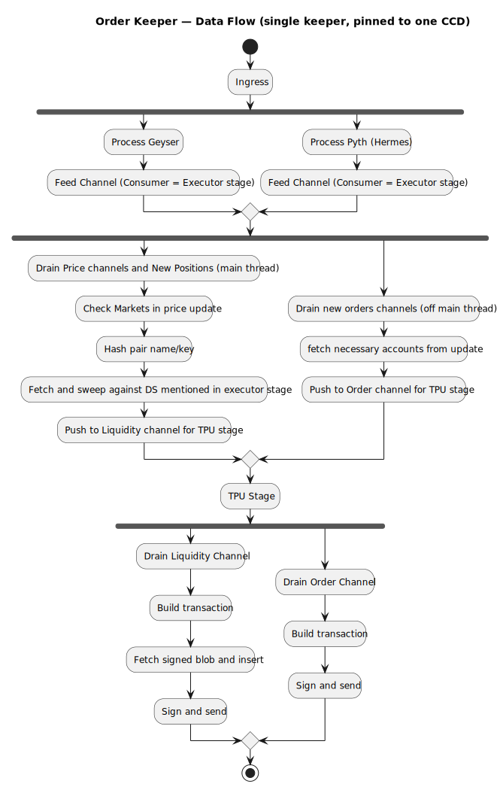

# Table of Contents

1.  [The assignment](#orgca3b979)
2.  [Scope Choice](#org2bc21ee)
    1.  [Why?](#org0fd0efd)
3.  [Proposal](#orge011d6e)
    1.  [Order keeper bot](#org4b2d890)
        1.  [Main responsibilites](#org90e89f0)
        2.  [Architecture](#org414af9b)
        3.  [Thread Layout of stages on hardware](#orga67882a)
4.  [Keeper Fleet](#orgefb91fe)
        1.  [Core responsibilities](#orgd200674)
        2.  [Detection and reviving](#orgd32fee0)
        3.  [Blocking](#orgec8734d)
        4.  [Market Division.](#org2724939)
5.  [Hardest / Most overlooked part of this system](#orgd9085e7)
    1.  [Transaction reliability under stress](#org603ebf6)
    2.  [Bundle racing](#org1f39d7b)
    3.  [Split between liquidation check and signed blob ingestion on the keeper](#org22815fc)
    4.  [Parallelism of work across keepers](#orge5705ec)
    5.  [Confirmation-window race](#org67dd964)
    6.  [Design requirements](#orgc4ba6a8)
    7.  [Infra for metrics consumption](#orgddfdb90)
    8.  [Transaction confirmation / Error parsing and retry](#orge4742b0)
6.  [Cold boot of a keeper](#orgbaa3cbf)
7.  [Data Flow](#org9703ea0)
8.  [Other aspects considered but not explored](#org01d32c1)
    1.  [Parsing data](#orgd4baf39)

# The assignment

 Our main repo is GMX-Solana (a Solana implementation of GMX):
<https://github.com/gmsol-labs/gmx-solana>
After reading the code, design the off-chain Keeper service for this protocol from scratch.
We won&rsquo;t tell you what functions the Keeper should include — figuring out what must exist vs. what can wait is part of the exercise.
Your proposal should address:

What responsibilities should the Keeper take on? Why these and not others? Which must ship in v1, which can be deferred?
Overall architecture and data flow
Key engineering trade-offs and your reasoning
What you consider the hardest, most error-prone, or most easily overlooked part of this system

If after reading the repo you think there&rsquo;s a different module more worth tackling (off-chain backend scope only), you may choose your own — but justify the choice at the top of your report.

Time limit: 48 hours, starting from when you receive this message.

Total: 17 hours

# Scope Choice

I stuck with the keeper system, trimmed towards an order keeper system. 

## Why?

Because in my opinion for any on chain trading platform, it&rsquo;s the load bearing component. Also exercises most of the protocol, which would introduce me to the repo and it&rsquo;s subparts (Quite a challenge!)

# Proposal

## Order keeper bot

### Main responsibilites

-   Order detection and execution -> From my understanding these seem to be the main way of interacting with the product
-   Liquidity detection and execution -> This is the main feature from protecting excessive losses of user and the protocol. Given highest priority of execution
-   No position update support -> This can be deferred. But would require the In memory cache to be updated per update
-   No GLV support
-   No GLT support
-   No ADL detection and trigger support (MVP proves liquidation and ADL detection would follow similar logic)
-   Assumes markets have been setup already
-   Assumes external manager for roles provision and configs for these keepers. I.e ORDERKEEPER

### Architecture

1.  Update ingress and execution

2.  Machine for cache sizes and hardware topology = Ryzen 9950 X

    -   NOTE
        -   Geyser has been chosen over rpc pubsub for reducing latency of on chain action updates
        -   Order Will not be filled if during execution time price update shows that the trigger price has already hit (Still am not sure about this decision)
    -   This will define the memory model first.
        SDK provides helpers to deserialize and cache hits. So, I&rsquo;ll focus on hardware layout.
    
    1.  Ingress
    
        Since Network I/O is the biggest latency factor (pnl and liquidation calculation is pure math), the design should be an parallel thread that has 2 data sources:
        
        1.  Geyser updates, for on chain updates
        2.  Price Feed Ingest for token pair updates
        
        1.  Geyser
        
            Listens to Market Accounts, uses the sdk to deserialize into MarketModel struct (Market struct is 9kb it would fit comfortably inside L2 cache &asymp; 1 mb per core. So L2 cache hit time is what I&rsquo;m optimizing for here. Since L2 is per cpu, ideally the threading lands on the hyperthread on the same cpu as the main thread, otherwise L3 hits are fast enough too, within the same CCD\*)
            Now MarketModel which the sdk deserializes for me, comes in around 80 bytes (Not sure what I can strip here, to reduce size, so taking 80 bytes as considretion). But the issue is with multiple relevant markets. Since The Keeper Fleet, divides responsibilites between keepers to reduce competition, I&rsquo;d design around it, saying that one keeper has a &ldquo;Hot Set&rdquo; of markets to work with, and if I pass around the MarketModel, which holds a pointer to the market struct (Heap Alloc), then 80 bytes fits ~1.25 cachelines.
            
            Fetches relevant Position account and deserializes into PositionModel . Suggested improvement -> PositionModel copies MarketModel into it&rsquo;s struct. Could just use a Ref or Arc if shared between multiple threads. 
            
            On Position close, invalidate cache, and wait for other updates
            
            Also, responsible for checking new order openings. These updates are not passed to the main thread, instead passed to an offthread for calc, tx building and sending, since this is not as critical. Main thread is the most critical hot path.
            
            Once the Struct is created, use a channel to send updates to main thread. Main thread then invalidates and updates it&rsquo;s own cache (if on seperate CPU), or just replaces value (within same CPU, given that the data fits in L2)
        
        2.  Price feed
        
            The only responsiblity of this async task, is to ingest price updates from Feeders. And for relevant markets, keep pushing to main thread via channel (crossbeam or otherwise, should be a spsc for mvp, but if there are multiple markets then use mpsc)
    
    2.  Execution (Main thread)
    
        The market model and list of relevant markets for this keepr (driven by config, explained under Keeper Fleet section) is tied to the Open positions. Prices come in token pairs. 
        Per price update, that market and it&rsquo;s relevant positions need to be scanned an checked for liquidation. Hence the Data Structure chosen here is `HashMap<Hash(TokenPair), (MarketModel,Vec<OpenPosition>>)` The reason why is, the whole data set cache friendly, for iterating over entries to check liquidation for any of the open positions.
        
        For every found liquidation event, the relevant accounts for liquidation action on chain are put into a channel, which is drained by our tpu stage for building and sending. The channel ties the main execution thread to the Liquidation sending channel. 
    
    3.  Execution (Off main thread)
    
        This receives open orders from the above parsers. And build and send Execute\* instructions for the same.
        
        If liquidation is valid, send to TPU unit via the orders channel for transaction sending and confirmation.
    
    4.  Metrics to track
    
        -   L2D Cache hits (main thread)
        -   Geyser Update invalidation rate
        -   Ratio of calculated liquidations : success rate
    
    5.  Main concerns here:
    
        -   For the async tasks consuming data from geyser and price feeds, Ideally I&rsquo;d measure how many times the syscalls trap into kernel, and what&rsquo;s the overhead there. Not adding it to the design since I don&rsquo;t have numbers, but if the overhead is high kernel bypass (AFXDP) is a valid option.
        -   I see events being emitted by the program. They could be valid metrics to track for robust insight into success rate and the reason why if failing.
        -   This design uses a single stream for data. i.e: single geyser stream, single price feed stream.
            A better design would be to do something like so:
        
            async fn ingest_stream1() -> Result<GeyserUpdate, Err>{
            todo!();
            }
            async fn ingest_stream2()-> Result<GeyserUpdate, Err>{
            todo!();
            }
            loop {
            // using a ring buffer here, because the channel needs to be drained by main thread. Mutex is used here because main thread could drain at the same time, a true ring buffer would be lock free with Acq:Rel semantics, which a channel would provide. This is just a Proof of concept
            let mut geyser_updates: Arc<Mutex<VecDeque<GeyserUpdates>>>;
            tokio_select!{
                Some(update) = ingest_stream1() => {
                let guard =  geyser_updates.lock().unwrap();
                guard.push_back(update);
                }
                Some(update) = ingest_stream2() => {
                let guard =  geyser_updates.lock().unwrap();
                guard.push_back(update);
                }
                }
            }

3.  Transaction sending & reliability

    1.  Responsibilites
    
        -   Sending transactions using a transport layer that&rsquo;s performant and reliable (skewing towards reliability)
        -   Appending Signed Blob for PriceFeeder before sending transactions (This is done to avoid a I/O syscall on the hotpath and ruin cache locality)
        -   Transaction confirmation (Off thread but falls under the same Stage) and retry
    
    2.  Design
    
        Using RPC to send and confirm transactions is easy to use but leaves reliability on the table.
        A better approach would be to send directly to leaders with a fanout strategy via a staked connection. I have worked with TPUCLIENTNEXT before for the anza client and have measured reliability and performance gains for the same. It abstracts the leader fanout strategy and QUIC connection management, for confirmation, we&rsquo;d use a transaction confirmation task (async). [example](https://github.com/rpcpool/yellowstone-jet/blob/b3873c4db22be9680a371d5a61662c3225262ea1/apps/jet/src/transactions.rs#L223) . This avoids the extra hop, but increases infra maintainence requirements though, and if that needs to be avoided, going through RPC is preferable. 
        
        That being said, this proposal is not considering budget or manpower as limitations, and trying to build out a performant and reliable keeper system.
        
        This stage holds an internal deque, which it pops off the front for the next batch to be executed and sent. Liquidations if found in the execution stage, are put to the front of the dequeu at the highest priority to be drained, while Order filling actions are set to the back. 
        This has a priority inversion problem though, which is not being addressed here. But, trying to solve that would actually increase the complexity and the amount of maintainence needed. Easier solution is to have 2 seperate queus
        
        I&rsquo;ve also noticed an optimize() method in the sdk, that squashes transaction batches to make them smaller, which would be nice to have and is added as the last pass
        
        Which looks like:
        
        
        
        While the actual sending operations over the individual queues:
        
        
    
    3.  Metrics to track
    
        -   Transactions sent per update
        -   Ratio of transaction sent : successful confirmation
    
    4.  Main concerns
    
        -   This assumes that we have a way to get a staked connection to the leader.
        -   I&rsquo;m genuinely split between making this off thread vs including this in hot path. Essentially the tradeoff I&rsquo;m envisioning is this
            Same thread, hot cache on relevant accounts faster egress
            Off thread, main thread keeps computing as data comes in
            
            So, I&rsquo;m going with a hybrid. Transaction egress on the main thread (building and sending). The confirmation and subsequent retries off thread in a task
        
        -   I havent&rsquo; calculated instruction sizes, but by eyeballing I see a large number of accounts per instruction. If they spill into multi transaction batches (I see the sdk has Batch helpers and sequential confirm and send sendall() methods), but this opens up issues, where atomicity is not guaranteed. if there&rsquo;s a batch of 3, tx 2 and 3 could fail and leave my keeper in a confused state. For this, I would use Jito Bundles that provides atomicity to avoid this issue, at the cost of higher auction fees.

### Thread Layout of stages on hardware

Main thing to note, is that given the size of updates and frequency, we want all threads to operate within the Same CCD NODE, to avoid external L3 refills. For the hardware choice, L3 is shared between the ccd, and L1 and L2 are private per core. The data structure on the execution stage is chosen to fit L2. and the execution stage executes on the main thread.
Hence:

-   Ingress stage Same CCD as main thread but off thread. Communicates to main thread via channels.
-   Executor Stage. Main Thread. Data structure mentioned in the executor section stays in L2 cache, and updates in place. Optional Upgrades: I don&rsquo;t know what fields can be trimmed for the data structure for v1, otherwise could attempt L1. This sends triggered liquidation account data to Egress stage. 2 seperate queues based on whether they&rsquo;re order actions or liquidations
-   TPU Stage (Egress). 2 Threads. Same CCD. Drains threads from the 2 channels from Executor stage, and builds transactions, inserts signed blobs and sends via TPU to leaders with a fanout strategy

# Keeper Fleet

### Core responsibilities

-   Detect and revive underperforming keepers
-   Block malicious keepers
-   Market Division between keepers to keep competion within the fleet low

This design is load bearing on configs used by keepers. The config would be a small .json file that looks like

      ValidMarkets: {
      "BTC / USDC",
      "ETH / SOL"
    } 

### Detection and reviving

This needs a service running that polls mapped keepers on it&rsquo;s /health endpoint and also relevant metrics.

-   It should poll /health. And if down, remove from internal list of keepers, and update configs of the remaining keepers to balance out the markets.
    A redundancy note that should be used in this case, is copy the markets twice. I.E &ldquo;BTC / USD&rdquo; would be copied between Keeper A and Keeper B. There would be some competition in that case, but in case a Keeper fails, there&rsquo;s a fallback
-   In case a keeper is down, try to autorevive, or notify admins

### Blocking

For MVP, this would require a seperate tx stream from geyser, belonging to this manager node.
The idea is to use [logsSubscribe](https://solana.com/docs/rpc/websocket/logssubscribe) via geyser, and watch error rates (runtime errors only) and map to keepers. Using a modified token bucket algorithm, we can start maintaining a map `HashMap<Pubkey,u64>` of failure counts that if crosses a threshold, could remove ORDERKEEPER role from said keeper. Or at least notify as sysadmin

### Market Division.

The idea here is division of labor.
We get a list of markets as a rpc fetch (no need to stream, since this is low volume update), and hash markets based on identifier (maybe Market Key?), and use that as a round robin dispatch, when autogenerating config files `Hash(MarketKey)%keeper_count` . And this could be rebalanced, if the Detection section detects a keeper is down, to rebalance, updating keepercount

# Hardest / Most overlooked part of this system

## Transaction reliability under stress

Although my suggestion of tpu client next, improves reliability of transactions hitting leader and via staked connection higher chance of getting my transactions processed, it doesn&rsquo;t deal with validator scheduler heurisitics at all. 
My naive solution to this, would be to maximize compute budget priority fees to have my transactions executed

## Bundle racing

The TPU Egress part of the keeper pipeline is a bit fragile. There&rsquo;s replication across 2 keepers for every market. But, bundles have no guaranteed atomicity, and between each transaction, is the possibility of failure, frontrunning, or another keeper racing for the same. 

Without a central orchestrator efficiency could be at risk, but without numbers and for v1 I think my design is a good starting point. Also as mentioned in the design above, JITO bundles could help provide atomicity at the cost of higher fees

## Split between liquidation check and signed blob ingestion on the keeper

This design choice stems from the fact, that hot path should not block on network requests. Hence, the ingress stage supplies the executor with prices to check for liquidation, which is then forwarded to the TPU stage, where it injects signed blobs. The reason for this is that the executor stage shouldn&rsquo;t block waiting for signed blob responses (network call), before processing next price mark.

The concern here is wasted cycles for scanning redundant accounts that could possibly be closed by transactions being sent. But, without numbers it&rsquo;s hard to tell if this is a concern of over optimization. Metrics defined in above section would be able to show if this is worth improving. 

## Parallelism of work across keepers

My current design, splits work based on markets, the issue is that caps parallelism to n (n = number of markets). Ideally I would like to maintain keepers based off position, but that requires heavier synchronization and orchestration by the manager node. The manager node has been kept lightweight for v1.

## Confirmation-window race

This whole price trigger based system for liquidation and geyser updates for orders, depends on updates from geyser and off chain services as latency.
Confirmation takes ~1.2 seconds, while processed is equal to block generation time (almost) ~400ms.

For orders, a potential optimization is to read shreds directly from the validator (or even processed status transactions insted of confirmed), to pre process updates and keep them in a staging buffer that gets triggered upon confirmation to be sent.

This way our keepers get a head start on processing, and can preload transactions to be sent

Issues with this approach:

1.  Stale signed blob and price drift. There needs to be another scan at the Egress stage, when it detects a confirmation to fire.
2.  Heavier load on Ingress stage. Much faster updates = lesser time for executor stage to breathe.

## Design requirements

The design needs 1 keeper per CCD to be efficient.
Which requires either cgroup twiddling or isolcpus to run uninterrupted for highest performance benefits. and each cpu governor mode in the CCD to be to set to performance

## Infra for metrics consumption

I have defined metrics but not described an infra system to consume those metrics.
I would choose prometheus to ingest metrics and grafana for dashboards for the same.

## Transaction confirmation / Error parsing and retry

The transaction confirmation task doesn&rsquo;t get a lot of description above, so I&rsquo;ll describe it here.
If a transaction succeeds, that&rsquo;s the happy path. We record relevant metrics (such as retriesneeded) and remove that position / order entry from our cache.

On failure, this has some edge cases:

1.  If failed due to account already closed by another keeper, don&rsquo;t retry and emit metrics of failure. (This could be optimized further by listening to geyser streams on processed or getting raw shreds and maintain a confidence metric for attempting a liquidation or order creation.)
2.  If failed due to signed blob expiry, fetch new and retry. The issue is, if this happens too many times, that would mean the keeper is underperforming or the time to get the signed blob is facing issues.
3.  Not valid liquidation, don&rsquo;t retry, and wait for streams to provide another opportunity

# Cold boot of a keeper

This requires scanning the config file (described in Keeper Fleet section), know which markets we care about, and read as fast as possible. Now this is time sensitive, since every second a keeper is down, means throughput of transactions is left on the table. Hence the read layer needs to be really fast.

The state of the art read layer is [Cloudbreak](https://blog.triton.one/inside-cloudbreak-indexing-architecture-for-performant-account-reads/) By trition which fits our needs very well, which uses Postgres as the DB.

The logic would be as such:

1.  Boot
2.  Read config file
3.  Look up relevant markets accounts.
4.  Look up open position accounts.
5.  Warm up cache for executor thread
6.  Open up geyser and PriceFeed streams

# Data Flow

The sections above go into detail, but this is a graphical representation

# Other aspects considered but not explored

## Parsing data

In the sdk and the helpers, I&rsquo;ve noticed parsing and deserializing uses a lot of allocations, which isn&rsquo;t great on the hot path. Would like to explore further zero copy mechanisms if this is a bottleneck in the keeper

