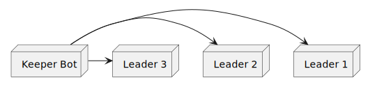
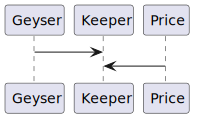

# Table of Contents

1.  [The assignment](#org31348d7)
2.  [Improvement notes:](#org98ced13)
3.  [Notes](#orgc53fb6d)
    1.  [chainlink datastream notes](#orge91742b)
        1.  [Performance first pass on decoding of data stream](#orgb273e14)
    2.  [Oracle Notes](#org66e4f67)
    3.  [Transaction sending for the keeper](#org3e1b4cb)
4.  [Order Keeper bot design](#orge56a586)
    1.  [MVP spec](#org7ad54af)
        1.  [Absolutely necessary](#org7213190)
    2.  [Challenges](#orgce45a06)
    3.  [Trasnsaction sending, confirmation, latency and reliability](#org7cda924)
    4.  [Health, observability and reliability of keeper bots](#org346a4ed)
    5.  [Miscellanious](#org02833de)
    6.  [On chain state ingestion](#org3109a55)
    7.  [Price Feed](#orgb50418f)
    8.  [Execution Speed and limitations](#orga19d5fa)
    9.  [Collision with other keepers](#orge466cc5)
5.  [Order Keeper Fleet Design](#orgc22a0cf)
    1.  [MVP spec](#orgfd62fd4)
    2.  [Design Notes](#org6481c58)
    3.  [Orchestration](#org5486858)
    4.  [Data transfer between layers](#orgc2a9777)
    5.  [Price ingestion redundancy](#org0f777e2)
        1.  [This section needs more thought, this is not how the on chain programs are laid out](#org6907355)
    6.  [Reliability.](#org232c8d6)
6.  [On chain program notes](#org9224e9b)
7.  [SDK notes](#org5eebb43)
8.  [Solana utils notes](#org8ae6478)

The human version of the assignment

# The assignment

 Our main repo is GMX-Solana (a Solana implementation of GMX):
<https://github.com/gmsol-labs/gmx-solana>
After reading the code, design the off-chain Keeper service for this protocol from scratch.
We won&rsquo;t tell you what functions the Keeper should include — figuring out what must exist vs. what can wait is part of the exercise.
Your proposal should address:

What responsibilities should the Keeper take on? Why these and not others? Which must ship in v1, which can be deferred?
Overall architecture and data flow
Key engineering trade-offs and your reasoning
What you consider the hardest, most error-prone, or most easily overlooked part of this system

If after reading the repo you think there&rsquo;s a different module more worth tackling (off-chain backend scope only), you may choose your own — but justify the choice at the top of your report.

Time limit: 48 hours, starting from when you receive this message.

Start time: 1:48 P.M IST - Jun 20th
            1:00 P.M IST - Jun 21th

End time: 9:00 P.M IST - Jun 20th
          7:00 P.M IST - JUN 21st
Total: 

# Improvement notes:

-   <del>Almost every struct has hand rolled padding, which makes sense. But ordering in reverse (largest field first) could remove overhead.</del> Would break readability and ABI though, not a good update.
-   No zero copy on the provided sdk to decode off chain stream

# Notes

-   Repo uses chainlink, pyth and switchboard for data streams. Tests mainly use pyth from eyeballing
-   No observability around keepers to check resource consumption or health
-   Uses slots to measure time which makes sense. Granularity pre-alpenglow is about 400ms per slot then. post alpenglow is 200 ms. My note around &ldquo;sub second updates&rdquo; on chainlink datastream get amplified.
-   README mentions malicious keepers manipulating orders, but the on chain programs follow a permissioned model. Not sure how that&rsquo;s a concern
-   Not sure what the virtual inventory handles. TODO: Look if relevant
-   Orders and positions happen seperately. Settling orders to convert to position would be keeper&rsquo;s job
-   TODO: What does Store account handle? What&rsquo;s different between this and the Store account?
-   GLV seems to be LP spread mechanism. Not needed for v1 for the keeper (?). Have the required IX from exchange folder
-   The virtual inventory holds reference to PoolStorage which can be either Pool or diversified
-   Market keepers need to exist alongside order keepers. My design doc currently only holds order keepers

## chainlink datastream notes

-   Chainlink docs says that it supports sub second updates. But that could mean longer than 1 block delay. TODO: Need data to verify p50/p99.
-   Microbenchmarks absent for decodeing streams. Tests are present though

### Performance first pass on decoding of data stream

-   Lots of branching paths. (TODO: check what match outputs as asm :GODBOLT:)
-   None of the methods are inlined explicityly. Need to check if rustc inlines them during compile with the keeper bot.
-   Error paths should be made cold.
-   these decode methods can be autovectorized. TODO: Check up asm output to see if they are (:GODBOLT:)
-   Need profiling data to measure overhead of syscall overhead from kernel to userspace. No presence of dpdk or xdp kernel bypass
-   Adding to the point above -> Depending on volume, the volume and latency of data coming in can cause significant additive cost of syscall overhead
-   No Zero copy deserialization while decoding reports.

## Oracle Notes

-   

## Transaction sending for the keeper

-   I&rsquo;ve worked on and with TPU Client Next from anza repo. Clear performance and reliability gains. Use the yellowstone transaction confirmation layer to append confirmation abilities onto it

# Order Keeper bot design

## MVP spec

### Absolutely necessary

-   Able to to settle orders
-   Able to liquidate
-   ADP\* would be good to have to prove LP are protected, but not supported for proving functionality
-   Pyth only oracle
-   <del>Not JITO bundle support. Opens risk to MEV and frontrunning, but for MVP not necessary to show validity of architecture</del>  Need JITO bundles to be able to guarantee gmsol Bundle execution

## Challenges

-   Chainlink and pyth is pull while switchboard provides and on demand stream. Let&rsquo;s isolate for the sake of the MVP to only pyth because tests are using that too, for my ease of understanding the existing system

## Trasnsaction sending, confirmation, latency and reliability

-   Sending over RPC is the slowest option available. We need to make sure transactions built by the keeper are send as quick as possible, while having the highest chance of landing.
    -   to this point, sending over TPU to the leader is the best path. Anza provides a TPU-Client-Next crate that provides relevant QUIC stream building and a transaction sending service over a easy to use wrapper.
    -   Transaction confirmation should happen seperately. Something along the lines of: <https://github.com/rpcpool/yellowstone-jet/blob/b3873c4db22be9680a371d5a61662c3225262ea1/apps/jet/src/transactions.rs#L223>
    -   Having experience in these and having measured both reliability and latency of transactions landing, this would be the better option.
    -   design note: For better transaction landing a DAG based system to batch non dependant transactions. CU fees could be paid at the highest amount to get priority for transaction landing (especially for liquidation events). UPDATE: the gmsol sdk provides bundles which represent order of execution already.
    -   Tracking metrics on transactions sent / second vs landed would be a good way to measure health and keeper bot service quality
    -   If using TPU Client Next. Auto handles fanout strategy.  
        
        

## Health, observability and reliability of keeper bots

-   Resource consumption should be tracked in case of failures.
-   Cron job with a /health endpoint (Not sure if this is needed with the previous markers)

## Miscellanious

-   As mentioned in the Transaction sending section, DAG packing would be a great way to make sure validator scheduler picks our transactions. But right now, they all go through the same on chain state. 
    -   Possible solution: Spin up copies of on chain programs, to break dependency cycles and keep throughput high. A second type of bot would be needed to track and manage this. NOTE: Actual metrics would be needed to decide if this is actually needed

## On chain state ingestion

-   Subscribe via geyser for relevant account states
-   The issue is that most accounts that I&rsquo;m seeing now are PDAs. That means, I can&rsquo;t subscribe to them beforehand. I&rsquo;ll need to subscribe to the program account and filter out what I need from that.
    Let&rsquo;s say that (2) keepers are responsible for a particular account set. Filtered by &ldquo;owners&rdquo; let&rsquo;s say. Then, for every ownedByProgram update, I need to filter, see if I have anything to work on, and then do the actual keeper reponsiblities (for MVP that&rsquo;s order settling, and liquidation).
-   Order settling would be a new account, so that&rsquo;s fine. The liquidation, needs to always read the existing positions the keeper is responsible for, fetch price, then decide on what to do.
    So, I would prefer it not compete with each other. Let&rsquo;s multithread it. I.e: Main thread gets the geyser update, on the main thread itself, the liquidation check and processing happens. To keep the cache warm, and not risk cache trashing by sending it to another core or worse CCD. and offthread, computes orders if needed.

## Price Feed

-   Using the existing infra surrounding this works.

## Execution Speed and limitations

-   Main concern is falling behind blocks and missing liquidation options. Every slot needs 400 ms to generate. Our execution and matching time including chainlink matching vs on chain state, transaction building should happen within that window, and try to send transactions with the highest confirmation rate possible. Another aspect that I&rsquo;ve heard chatter about is reading shreds directly, or even at &ldquo;processed&rdquo; state, and optimistically make calculations, and fire at &ldquo;confirmation&rdquo;, but this needs to be verified with data if it&rsquo;s worth it. Essentially the ratio of processed/confirmation
-   Every tx signed and sent, should be confirmed against asynchornously. short circuit on success (report metric), or on failure enumerate across failure classes to decide if it&rsquo;s worth retrying

## Collision with other keepers

-   Not sure if that&rsquo;s a requirement but blows up design scope. Essentially we&rsquo;ll have to try and get jito bundles in. Conflicting in the auction with our other bots won&rsquo;t be an issue, since they&rsquo;re sharded with individual copies

# Order Keeper Fleet Design

## MVP spec

-   <del>Raw Geyser stream (shared)</del> Simplify design, per keeper stream
-   Metrics on service health. Also, need to measure diff between block time and receive time on keepers

## Design Notes

-   Lazy trigger of tx execution. Don&rsquo;t poll and update PriceFeed every update. Only update, when the keeper should take action.
-   ISSUE: My current design forces a keeper to both watch for oder openings, and to actually trigger liquidations too. TODO: What would be the ratio of order keeping / liquidation events? Would be a good metric to track per keeper
-   TODO: Think through keeper bot balance consideration, it needs enough to be able to pay. Threshold marker with a notifier seems decent for mvp

## Orchestration

-   Round robin strategy? Each keeper stays responsible for a certain order? Hashing pubkeys and modulo with order list would work as a simple strategy. `hash(pubkey)%live_keeper_count`
-   decouple price feed, geyser streams and (if owned) private rpc providers from the keeper systems
-   Split multiple keepers across seperate machines for redundancies. But, need to update `live_keeper_count` for round robin to balance. This has a known difficulty, with updating livekeepercount in case a node fails back to the service splitting the stream. [HWR](https://en.wikipedia.org/wiki/Rendezvous_hashing) could be a better alternative here

-   The above isn&rsquo;t a great idea. Already simplified the design and removed the central orchestrator. Now, the issue is, There&rsquo;s no way to shard the responsiblity, without maintaining (n-1) connections from 1 keeper to others. A gossip protocol could work, but it would add additional network latency. 
    
    Alternatively, let them compete. The main backbone of this argument is, that any &ldquo;action&rdquo; by the keeper has to involve, update + action + cleanup. So, to avoid keepers from wasting cycles, it needs to check:
    
    1.  if there are open accounts relevant to the action and if it contains a unique filter set (let&rsquo;s say owner pubkey). Short circuit if so, wasting minimal cycles. This is also to avoid racing with another keeper between transactions
    2.  Since the &ldquo;actions&rdquo; are split up into multiple transactions, they are not atomic anymore. Let&rsquo;s just let them race for mvp. Since coordinating this, would require a central manager or a gossip protocol to coordinate
-   Essentially, let&rsquo;s remove orchestration, and take the hit. The fees per tx (failed or otherwise) is around 5000 lamports, so it shoudl be fine. What is needed, is to confirm the transaction, parse the errors, and stop retrying to avoid excessive waste.

## Data transfer between layers

-   geyser can only transport via grpc via protobuf. Not sure what format chainlink provides, but based on the crate it&rsquo;s a byte array too. TODO: would need to measure the actual impact of deserializing these vs the cost of aggregating them to send to keepers.
-   ISSUE: This is creating a single point of failure. As opposed to this, a geyser stream and a chainlink data stream to individual keepers could be appropriate too. Would remove overhead of coordinating node failures and boot ups too. targeted data streams would help too, with the overhead of matching them individually. Would remove latency of passing between dispatcher and the data sources

_[dispatcher diagram missing — no `dispatcher.svg` was ever generated]_

vs

## Price ingestion redundancy

-   <del>Now, this design is considering as chainlink as the best, but that&rsquo;s not valid.</del>
    <del>Ideally we make them compete. I.e: pyth, switchboard and chainlink per keeper for it&rsquo;s selected critical sections.</del>
    <del>something along the line of:</del>
    Design of existing system invalidates this. TokenConfig ensures only 1 type of feed for a token pair
    
        async fn ingest_chainlink() -> Result<ChainlinkType, Err>{
            // pull 
        }
        async fn ingest_pyth()-> Result<PythType, Err>{
            // pull 
        }
        async fn ingest_switchboard() ->Result<SwitchboardType, Err>{
            // pull 
        }
        let mut price_data: Result<UnifiedInterface, Err>;
        tokio_select!{
            Some(feed) = ingest_chainlink() => {
                price_data = feed.parse()?;
            }
            Some(feed) = ingest_pyth() => {
               price_data = feed.parse()?;
            }
            Some(feed) = ingest_switchboard() => {
               price_data = feed.parse()?;
            }
            
        }

NOTE: This occurs per keeper off main thread. Results are passed back into main thread to compare and calculate PnL

I see a config for token vs feed, that may change this approach

-   Scratch the above. There&rsquo;s a TokenConfig that sets expected provider in programs/states/oracle/mod.rs (truncated)
-   Racing could still be helpful, where each keeper opens multiple streams and races them to see which arrives first, but it&rsquo;s a redundancy strategy. TODO: Think deeper if this is needed

### This section needs more thought, this is not how the on chain programs are laid out

## Reliability.

-   This section is for managing bad keepers
-   Essentially if a keeper goes rogue and starts spamming bad transactions, how do we manage it?
    The idea around this, is to run a service, that listens for failed tx updates, keeps track of which keepers sent the transactions, and with a token-bucket system

# On chain program notes

-   Keeper needs ORDERKEEPER role
-   PriceFeed needs update (oracle.rs) before any actions, otherwise checks will fail
-   liquidate needs nonce? TODO: check why. Update: nonce is the seed to avoid multiple transactions for the same account.
-   NOTE: While checking if liquidation is valid in uncheckedprocesspositioncut -> withprocessopts , it clears all prices
-   Why inline(never) in createorder?
-   Order is created while trying to liquidate, executes and closes within the same t This math is needed to verify.
-   MarketModel can be created like so: [link to examples](https://github.com/gmsol-labs/gmx-solana/blob/main/examples/market.rs#L56)
-   Market struct size: 1 + 1 + 1 + 5 + 8 + 64 + 32 + 1520 + 192 + 3472 + 3488 + 32 + 32 + 192 = 9040 bytes &asymp; 9 kb . Can&rsquo;t tell which ones can be stripped for mvp to fit cachelines
-   Size of position struct = 224 bytes 
    MarketThreshold holds the values I need for trigger evaluation

# SDK notes

NOTE: The sdk provided has most of the stuff I already need. could try to pull of a mvp, by replacing the pubsub with a geyser stream and measuring diffs.

-   There&rsquo;s a market discovery helper, that uses a pubsub over Client, that already sets up relevant accounts to listen to
-   Token discovery too

# Solana utils notes

Typedefs and notes mostly

-   AtomicGroup for an atomic tx
-   optimize() methods that merge instructions. NOTE: (super helpful for the design)

TODO: FIX AND FINALIZE PROPOSAL DOC

